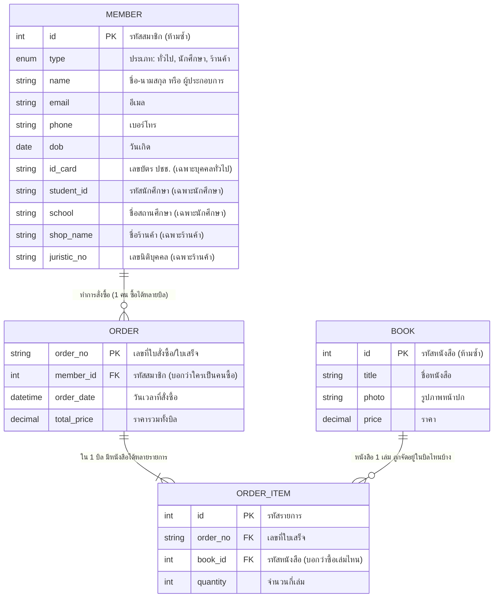

# ระบบร้านขายหนังสือออนไลน์ (Online Bookstore System)

เอกสารนี้เขียนขึ้นเพื่ออธิบายการทำงานของระบบ

---

## 1. Flow การทำงานของระบบ (แผนผังขั้นตอนการทำงาน)
**Flow ** 

ด้านล่างนี้คือขั้นตอนตั้งแต่ผู้ใช้เข้ามาสมัครสมาชิก เลือกว่าเป็นสมาชิกประเภทไหน จนไปถึงขั้นตอนการสั่งซื้อหนังสือ

```mermaid
flowchart TD
    A[เริ่มเข้าสู่เว็บไซต์] --> B{มีบัญชีผู้ใช้หรือยัง?}
    B -- มีแล้ว --> C[เข้าสู่ระบบ / Login]
    B -- ยังไม่มี --> D[เข้าสู่หน้าสมัครสมาชิก]
    
    D --> E{เลือกประเภทสมาชิก}
    E -- บุคคลทั่วไป --> F[กรอกข้อมูล: เลขปชช, ชื่อ-สกุล, อีเมล, วันเกิด, เบอร์โทร]
    E -- นักเรียน/นักศึกษา --> G[กรอกข้อมูล: รหัสนักศึกษา, ชื่อ-สกุล, ชื่อสถานศึกษา, แนบรูปบัตร, วันหมดอายุบัตร, อีเมล, วันเกิด, เบอร์โทร]
    E -- ร้านค้า --> H[กรอกข้อมูล: ชื่อผู้ประกอบการ, ชื่อร้านค้า, เลขนิติบุคคล, แนบเอกสารนิติบุคคล, อีเมล, เบอร์โทร]
    
    F --> I[ตรวจสอบข้อมูล / ยืนยันการสมัคร]
    G --> I
    H --> I
    
    I --> J{กรอกข้อมูลครบไหม?}
    J -- ไม่ครบ/ผิดพลาด --> K[แจ้งเตือนให้กลับไปแก้ไข]
    K --> E
    J -- ครบถ้วนถูกต้อง --> L[บันทึกข้อมูลสมาชิกลงระบบ]
    L --> C
    
    C --> M[เข้าสู่หน้าเลือกซื้อหนังสือ (ดูรูป, ราคา)]
    M --> N[เลือกหนังสือใส่ตะกร้า]
    N --> O[ยืนยันการสั่งซื้อ]
    O --> P[ระบบออกใบเสร็จ (มีเลขที่ใบเสร็จ, สรุปราคา)]
    P --> Q[ชำระเงิน และ เสร็จสิ้น]
```

---

## 2. ER Diagram 
**ER Diagram ** 
- **แฟ้ม MEMBER (สมาชิก):** เก็บประวัติลูกค้า
- **แฟ้ม BOOK (หนังสือ):** เก็บรายชื่อหนังสือ
- **แฟ้ม ORDER (ใบสั่งซื้อ):** เก็บประวัติว่าใครซื้อตอนไหน
- **แฟ้ม ORDER_ITEM (รายละเอียดในใบสั่งซื้อ):** เก็บว่าในบิลนั้นซื้อหนังสือเล่มไหนไปบ้าง เล่มละกี่ชิ้น

*(`PK` = Primary Key หรือ "รหัสประจำตัว" ที่ห้ามซ้ำกัน ส่วน `FK` = Foreign Key หรือการเอาเลขรหัสประจำตัวของแฟ้มอื่นมาแปะไว้เพื่อให้อ้างอิงหากันเจอ)*


